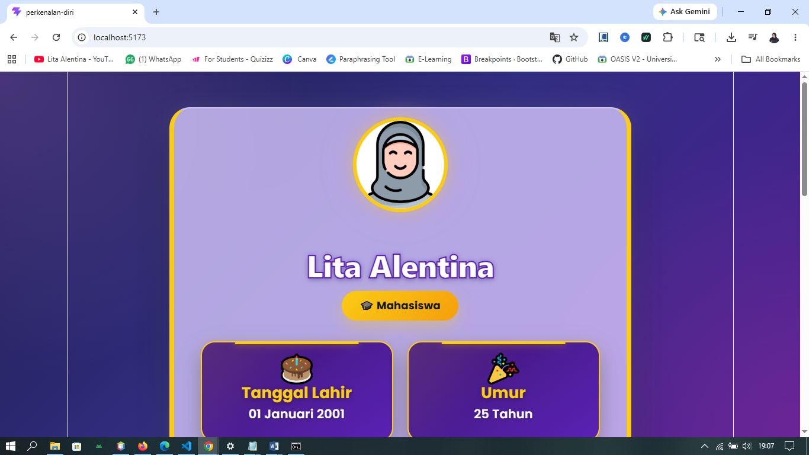
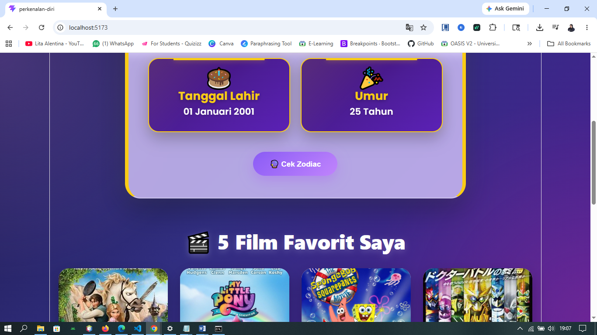
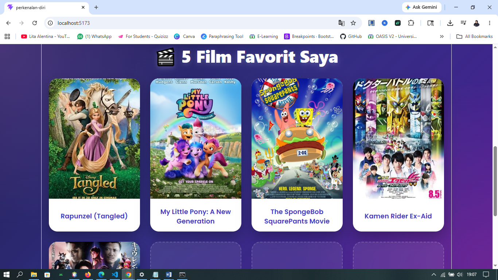
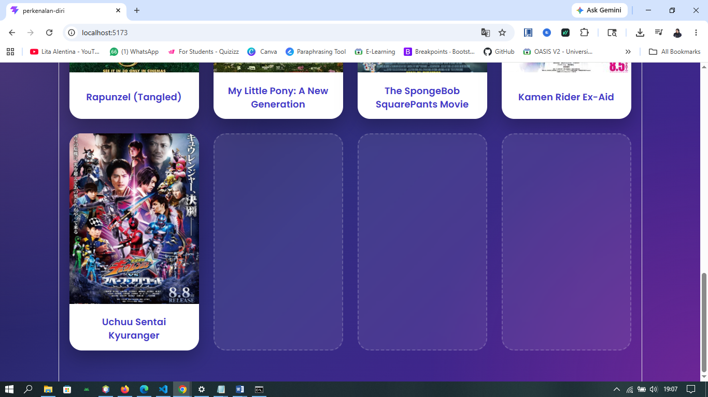

# 🌸 Tugas React Vite - Perkenalan Diri

## Screenshot Aplikasi

### Tampilan 1


---

### Tampilan 2


---

### Tampilan 3


---

### Tampilan 4


---

### Tampilan 5


---

## 👩‍💻 Data Diri

- **Nama:** Lita Alentina
- **Pekerjaan:** Mahasiswa
- **Tanggal Lahir:** 01 Januari 2001

---

## ✨ Fitur

- 👤 Menampilkan data diri
- 🎂 Menghitung umur otomatis
- 🔮 Cek zodiac berdasarkan tanggal lahir
- 🎬 Menampilkan 5 film favorit
- 🎨 Tampilan modern dan responsif
- 💜 Tema ungu lilac dengan aksen emas

---

## 🎬 Film Favorit

1. Rapunzel (Tangled)
2. My Little Pony: A New Generation
3. The SpongeBob SquarePants Movie
4. Kamen Rider Ex-Aid
5. Uchuu Sentai Kyuranger

---

## 🛠️ Teknologi

- React JS
- Vite
- JavaScript
- CSS3

---

## 🚀 Menjalankan Project

Install dependency:

```bash
npm install
```

Menjalankan project:

```bash
npm run dev
```

Build project:

```bash
npm run build
```

---

## 🔗 GitHub Repository

https://github.com/LitaAlentina287/tugas-react-vite-lita

---

## 👩‍🎓 Author

**Lita Alentina**
